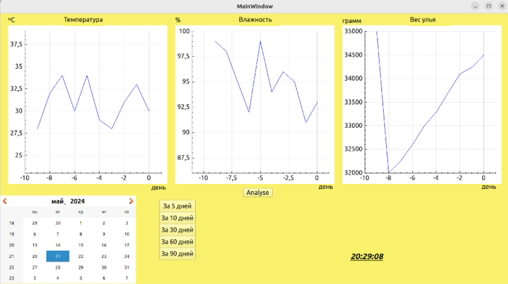

# 🐝 Apiary Project: Beehive Monitoring Dashboard 📊

Десктопное приложение на **C++/Qt** для реализации автоматизированного рабочего места пчеловода. Программа эмулирует сбор данных с датчиков улья (температура, влажность, масса), сохраняет историю в **SQL-базу данных** и предоставляет наглядную аналитику с помощью интерактивных графиков и системы оповещений.

[](https://isocpp.org/)
[](https://www.qt.io/)
[](https://www.qt.io/product/qt-sql)
[](https://www.qcustomplot.com/)

---

## 📸 Скриншот приложения



---

## 🌟 Ключевые возможности

*   **Интерактивная визуализация:**
    *   Отображение динамики **температуры**, **влажности** и **массы мёда** на графиках.
    *   Гибкая фильтрация данных по временным периодам (5, 10, 30, 60, 90 дней).
*   **Интеллектуальная система оповещений:**
    *   Анализ текущих показателей на основе заданных правил (например, критическая температура, влажность, резкое изменение веса).
    *   Всплывающие окна с **предупреждениями и рекомендациями** для пчеловода.
*   **Работа с базой данных:**
    *   Подключение к **SQL-базе данных** для хранения и извлечения исторических данных.
    *   Симуляция данных для демонстрации функционала без подключения к реальным датчикам.
*   **Удобный интерфейс:**
    *   Интуитивно понятный графический интерфейс, созданный с помощью Qt Widgets.
    *   Отображение текущего времени.

---

## 🛠️ Технологический стек

*   **Язык программирования:** C++ (стандарт C++11)
*   **Фреймворк:** Qt (модули Core, GUI, Widgets, SQL)
*   **Библиотека для графиков:** QCustomPlot
*   **База данных:** Любая, поддерживаемая Qt SQL (в проекте заложена логика для подключения).

---

## 🚀 Начало работы

### Требования

*   Установленная среда разработки **Qt** (версия 5.15 или новее) со компилятором MinGW/GCC/Clang.
*   Библиотека **QCustomPlot** (уже включена в репозиторий).

### Сборка и запуск

1.  **Клонируйте репозиторий:**
    ```bash
    git clone https://github.com/Vasja1142/ApiaryProject.git
    cd ApiaryProject
    ```

2.  **Откройте проект в Qt Creator:**
    *   Запустите Qt Creator и откройте файл `ApiaryProject.pro`.
    *   Qt Creator автоматически настроит проект на основе этого файла.

3.  **Настройте виджеты для графиков:**
    *   Откройте `mainwindow.ui` в режиме **"Дизайн"**.
    *   Кликните правой кнопкой мыши на каждом из трёх виджетов (`widget`, `widget_2`, `widget_3`).
    *   Выберите в контекстном меню "Повысить до..." ("Promote to...").
    *   В открывшемся окне введите `QCustomPlot` в поле "Имя класса повышенного виджета" ("Promoted class name") и нажмите "Добавить", а затем "Повысить".

4.  **Соберите и запустите:**
    *   Нажмите зеленую кнопку "Запустить" (▶) в левом нижнем углу Qt Creator.
    *   Программа скомпилируется и запустится.

---

## 📂 Структура проекта

*   `mainwindow.h` / `cpp` / `ui`: Основное окно приложения. Содержит всю логику интерфейса, обработку событий и взаимодействие с графиками.
*   `qcustomplot.h` / `cpp`: Файлы сторонней библиотеки для построения 2D-графиков.
*   `connection.h`: Заголовочный файл для настройки и управления соединением с базой данных (логика подключения).
*   `main.cpp`: Главная функция, точка входа в приложение.
*   `ApiaryProject.pro`: Файл проекта Qt, описывающий его структуру, зависимости и исходные файлы.

---

## ✍️ Авторы

*   **Агзамов Артур**
*   **Гордеев Василий** ([@Vasja1142](https://github.com/Vasja1142))
*   **Комягин Данил**
*   **Пичайкин Матвей**

*Дата создания: 16.05.2024*
